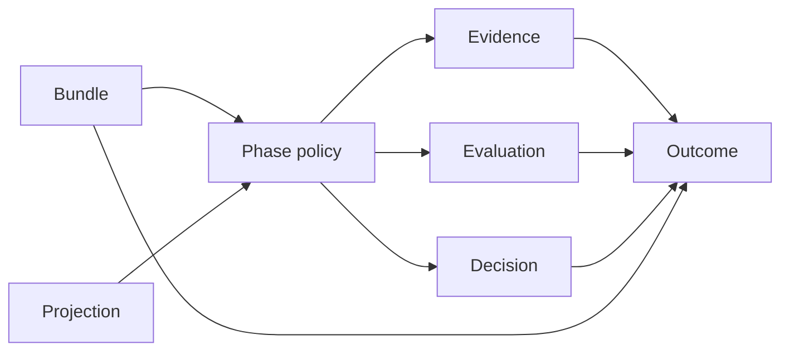
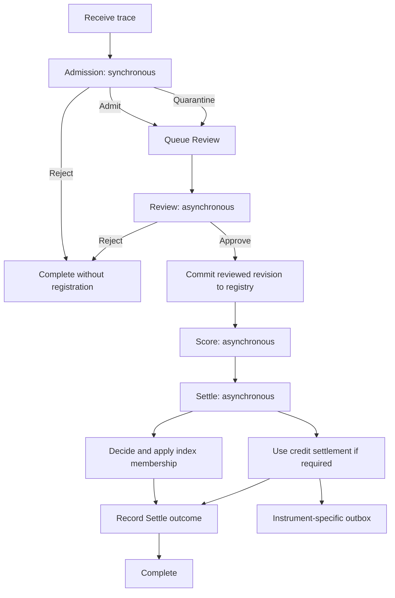
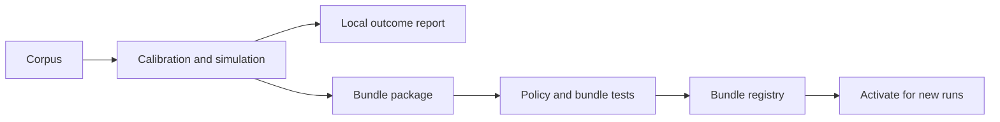

# Versioned Pipeline Processing Design

> A small model for processing traces, explaining outcomes, and changing policy safely.

- **Status:** Proposed target design
- **Date:** 2026-09-09
- **Scope:** Domain model, workflow, persistence, policy development, and rollout

## Review guide

This iteration replaces the previous independent-workflow design with one
pipeline and four phases:

1. Admission
2. Review
3. Score
4. Settle

One immutable bundle selects all four policies. Each phase stores one outcome.
The outcome contains the decision, the evidence, and the evaluation.

The design does not add durable observations, facts, deployment assignments,
effect records, vector epochs, or a generic schema registry.

## 1. Goals

The design has four goals:

- Explain why a trace produced each pipeline outcome.
- Let one Score decision award multiple instruments at the same time.
- Make each policy and complete bundle easy to test.
- Keep policy development separate from policy execution.

The design does not require deterministic replay. An outcome must explain past
behavior, even when its external inputs are no longer available.

The design does not define one true value for a trace. A Score policy combines
one or more valuations into the credit decision for its bundle.

## 2. Domain model

The design uses seven domain concepts.

### Phase

A **phase** is one step in the pipeline:

- **Admission** decides whether processing can continue.
- **Review** transforms and approves the trace for the registry.
- **Score** assigns ordered, instrument-keyed awards.
- **Settle** decides index membership and applies every instrument operation.


### Policy

A **policy** is the versioned implementation of one phase. Examples include:

- An Admission policy that accepts every valid request.
- A Review policy that removes PII.
- A Score policy that assigns a fixed amount.
- A Score policy that aggregates valuations from several participants.
- A Settle policy that updates the index and uses the existing credit process.

Each policy owns its internal algorithm and dependencies. An observer, scorer,
embedder, or vector index is a policy dependency, not a durable domain concept.

### Bundle

A **bundle** is the complete pipeline configuration. It selects one policy for
each phase and all immutable deployed inputs for those policies.

One bundle processes one pipeline run. A policy change creates another bundle.
An active bundle change affects new runs only.

### Projection

A **projection** is the versioned input that a policy gives to an observer.
It has no independent record or lifecycle. Its identifier and input hash appear
in evidence when they affect a decision.

### Decision

A **decision** is the typed result of a phase:

```rust
enum AdmissionDecision {
    Admit,
    Quarantine { reason: ReasonCode },
    Reject { reason: ReasonCode },
}

enum ReviewDecision {
    Approved { registry_revision_id: RevisionId },
    Rejected { reason: ReasonCode },
}

struct ScoreDecision {
    awards: InstrumentAwards,
}

struct InstrumentAward {
    instrument_id: InstrumentId,
    atomic_units: u64,
}

enum IndexMembershipDecision {
    Exclude { reason: ReasonCode },
    Include { command_hash: ContentHash, entry_count: u32 },
}

struct SettleDecision {
    index_membership: IndexMembershipDecision,
    settlement_operations: Vec<InstrumentSettlement>,
}

struct InstrumentSettlement {
    instrument_id: InstrumentId,
    atomic_units: u64,
    operation_ref_hash: ContentHash,
    result_ref_hash: ContentHash,
}
```

`instrument_id` is a bounded safe label. Award and settlement collections sort
by that identifier and reject duplicates. An empty award collection is the
completed zero-award result. Each amount uses checked integer atomic units.

Trace Credit is the `trace_credit` instrument. One Trace Credit equals
1,000,000 microcredits. Its adapter converts microcredits to atomic units
exactly, without floating point. Decimal conversion rejects excess precision
and overflow.

An operational error is not a decision. The run remains retryable or moves to
a failed state with a safe error label.

### Evidence

**Evidence** records the state that the policy used. Evidence can contain:

- Rate-limit state and PII findings for Admission.
- The source revision and transformation report for Review.
- Measurements, index state, and valuation evidence for Score.
- The index-membership result and internal settlement batch for Settle.

Large or sensitive evidence stays in encrypted object storage. The outcome
contains bounded values and content hashes.

### Evaluation

An **evaluation** explains how the policy mapped its evidence to its decision.
It uses structured fields and stable reason codes, not free-form prose.

For example, Score evidence can contain an index snapshot, measurements, and
coverage. Its evaluation records the rule that produced credit and index
membership.

### Outcome

An **outcome** is the immutable record that groups these concepts:

```rust
struct Outcome<D, E, V> {
    outcome_id: OutcomeId,
    tenant_id: TenantId,
    run_id: RunId,
    trace_id: TraceId,
    phase: Phase,
    bundle_id: BundleId,
    outcome_schema: SchemaRef,
    decision: D,
    evidence: E,
    evaluation: V,
    recorded_at: DateTime<Utc>,
}
```

One outcome schema identifies the three payload types for a policy family. The
`bundle_id` resolves the exact deployed policies and configuration.

This diagram shows the complete reasoning boundary:




## 3. Bundle identity

A bundle manifest names the deployed inputs that can change a decision:

```rust
struct BundleManifest {
    format_version: u32,
    admission: PolicyRef,
    review: PolicyRef,
    score: PolicyRef,
    settle: PolicyRef,
}

struct PolicyRef {
    policy_id: PolicyId,
    code_artifact_hash: ContentHash,
    configuration_hash: ContentHash,
    data_artifact_hashes: Vec<ContentHash>,
    projection_ids: Vec<ProjectionId>,
}

impl BundleManifest {
    fn to_bundle_id(&self) -> BundleId {
        BundleId::from_hash(canonical_hash(self))
    }
}
```

Configuration includes thresholds and other parameters. Data artifacts include
models, bootstrap data, and fixed reference data when a policy uses them.

The bundle package contains the manifest and deployable artifacts. The ingest
service makes sure that the package matches its bundle identifier before use.

An outcome stores only the bundle identifier. The bundle registry retains the
package. The policy lab retains development runs and reports that produced the
bundle.

The bundle hash excludes mutable external state. A policy records the exact
external state that it reads as evidence.

Golden tests protect bundle identity. A change to code, configuration, data, or
projection identity must change the bundle identifier.

## 4. Workflow

The server binds the active bundle when it creates a run. Every phase in that
run uses the same bundle.




### Admission

Admission runs in the request path. It uses only bounded local work so that it
can complete before the response.

The policy can reject a request because of rate limits. It can quarantine a
trace because of synchronous PII risk. It can also admit a valid trace.

Admission validates the contribution path, schema, tenant grant, consent, and
allowed uses. Model-based substance and novelty valuation belongs in Score.

Admission can read indexes but cannot make external writes. This restriction
makes a repeated request safe before its outcome commits.

The evidence stores the hashes of any index, detector configuration, or
projection that affected the decision. Audit logs repeat hashes and safe labels
only.

An admitted trace still passes through Review. Quarantine requires Review to
address the Admission reason before approval.

### Review

Review runs asynchronously. It transforms the stored trace before the server
commits the approved revision to the registry.

A static Review policy can pass the trace through during tests. A production
policy can scrub PII or apply another required transformation.

Review uses only the submitted contribution artifact and server-generated
evidence. It cannot request or collect more contributor-side data.

The field `request_content_hash` identifies the exact approved artifact. The
Review outcome binds this source hash to the approved registry revision.

Review can query an index when its policy requires one, but it cannot modify an
index.

The Review outcome identifies the source revision, transformation evidence,
and approved registry revision. A rejected trace does not enter the registry.

### Score

Score runs after Review approves the registry revision. It determines an
ordered set of instrument awards. It does not define an objective trace value.

A Score policy can use:

- A fixed amount.
- Model-based substance and novelty measurements.
- A read-only query of the active index.
- One or more external valuations.

Score can read an index, but it cannot modify one. A shadow policy uses an
isolated index namespace and cannot affect an active decision.

If Settle can use an embedding, Score stores it as encrypted evidence. The
Score outcome stores only its artifact hash.

```json
{
  "decision": {
    "awards": [
      {
        "instrument_id": "trace_credit",
        "atomic_units": 200000000
      },
      {
        "instrument_id": "storage_rebate",
        "atomic_units": 5
      }
    ]
  },
  "evidence": {
    "index_id": "novelty-active-v1",
    "index_snapshot_id": "snapshot-42",
    "index_snapshot_hash": "sha256:index-snapshot",
    "index_cardinality": 8421,
    "projection_id": "canonical-summary-v3",
    "projection_input_hash": "sha256:reviewed-revision",
    "neighbors_requested": 10,
    "neighbors_returned": 10,
    "neighbor_summary_hash": "sha256:neighbor-summary",
    "embedding_artifact_hash": "sha256:embedding-artifact",
    "novelty_score_micros": 910000,
    "substance_score_micros": 870000,
    "coverage_micros": 1000000
  },
  "evaluation": {
    "rule": "compatibility-score-v1",
    "awards_id": "sha256:ordered-award-set"
  }
}
```

The bundle stores immutable thresholds and model configuration. The evidence
stores mutable index state and measured values that affected the decision.

Future Score policies can combine signed external valuations. A separate
protocol must define participant trust, quorum, and key management before
activation.

### Settle

Settle runs after every completed Score phase. It receives the committed Review
and Score outcomes and the bound bundle.

Settle decides index membership only from these immutable inputs. It cannot
query a mutable index or repeat valuation work to make this decision.

If Settle includes the revision, it creates deterministic entry keys. Each key
covers the tenant, index, reviewed revision, projection, model, and chunk.

Settle stores the encrypted index command and its hash before the index write.
A retry uses the stored command and does not repeat the membership decision.

An upsert with the same key and content is a successful no-op. A conflict with
different content fails closed. Queries exclude the same reviewed revision.

For each positive award, Score creates one eligible instrument operation with a
stable key for the tenant, run, Score outcome, and instrument. The instrument
adapter can group compatible operations into its own batches. The Trace Credit
adapter preserves existing holds, caps, issuer approval, source-list approval,
and duplicate-credit protection.

The server records the Settle outcome after all required index and instrument
operations complete. The decision returns every operation and its result
reference in deterministic instrument order. The runner persists and uses
those references; it does not reconstruct operations from mutable run state.
External payout remains in the instrument adapter's outbox. Its later state
does not change the Settle outcome.

Raw account references and transaction hashes do not appear in outcomes, audit
rows, or logs.

## 5. Policy contracts

The phase traits, result types, and decisions live in
`trace-commons-gate-api`. Policy implementations and persistence remain in
their server or gate crates. Client DTOs remain in
`trace-commons-protocol`.

Each phase has a small typed policy trait. This example shows the Score phase:

```rust
#[async_trait]
trait ScorePolicy: Send + Sync {
    async fn execute(
        &self,
        input: &ScoreInput,
    ) -> Result<PhaseResult<ScoreDecision, ScoreEvidence, ScoreEvaluation>, PolicyError>;
}

#[async_trait]
trait SettlePolicy: Send + Sync {
    async fn execute(
        &self,
        input: &SettleInput,
    ) -> Result<PhaseResult<SettleDecision, SettleEvidence, SettleEvaluation>, PolicyError>;
}

struct PhaseResult<D, E, V> {
    decision: D,
    evidence: E,
    evaluation: V,
}

struct ScoreRunner {
    policy: Arc<dyn ScorePolicy>,
}

struct IndexedScorePolicy {
    index: Arc<dyn VectorIndexReader>,
}

struct DefaultSettlePolicy {
    index: Arc<dyn VectorIndexWriter>,
    instruments: Arc<dyn InstrumentSettlementRegistry>,
}
```

Admission, Review, and Settle use the same result shape with their own types.
Runners hold policies as trait objects. Score policies receive read-only index
capabilities. Settle policies receive write capabilities.

Policies hold their scorers, embedders, vector indexes, and credit adapters as
trait objects. This boundary prevents Score from modifying an index.

Tests use small policy implementations through the production trait:

```rust
struct FixedScorePolicy {
    awards: InstrumentAwards,
}

#[async_trait]
impl ScorePolicy for FixedScorePolicy {
    async fn execute(
        &self,
        _input: &ScoreInput,
    ) -> Result<PhaseResult<ScoreDecision, ScoreEvidence, ScoreEvaluation>, PolicyError> {
        Ok(PhaseResult {
            decision: ScoreDecision {
                awards: self.awards.clone(),
            },
            evidence: ScoreEvidence::Fixed,
            evaluation: ScoreEvaluation::FixedAmount,
        })
    }
}
```

The design needs no mock-only policy hierarchy. A test implementation satisfies
the same contract as a production implementation.

## 6. Persistence and recovery

The workflow needs two new tables. Existing trace, registry, tenant, and account
storage remains outside this model.

```text
pipeline_runs
  tenant_id, run_id, trace_id, bundle_id
  request_idempotency_key, request_content_hash
  next_phase: admission | review | score | settle | none
  state: pending | leased | retry | complete | failed
  lease_token, lease_expires_at
  attempt_count, next_attempt_at
  last_error_label
  index_membership: undecided | excluded | included
  index_command_ref, index_command_hash nullable
  index_write_state: none | pending | complete | failed
  per-instrument operation and result references live in the settlement table
  created_at, updated_at
  unique (tenant_id, request_idempotency_key)

phase_outcomes
  tenant_id, outcome_id, run_id, trace_id
  phase, bundle_id
  outcome_schema_id, outcome_schema_version
  decision JSONB
  evidence JSONB
  evaluation JSONB
  recorded_at
  unique (tenant_id, run_id, phase)
```

`pipeline_runs` is mutable queue state. `phase_outcomes` is immutable history.
The run records index progress. Existing credit events, holds, batches, and
outbox rows record credit and payout progress.

The receipt path performs these operations:

1. Authenticate the request and derive the tenant.
2. Store the encrypted trace body.
3. Resolve and validate the active bundle.
4. Execute Admission.
5. Commit the run, Admission outcome, and next phase in one transaction.

The request key is unique within the tenant and binds to the request-content
hash. A replay returns the existing run. Reuse with different content fails.

An asynchronous worker performs these operations:

1. Claim a run with a fenced lease.
2. Load the bundle that is already bound to the run.
3. Execute the next phase.

Review and Score commit their outcome and next phase in one transaction. Settle
uses the staged command process below. A retry retains the bundle identifier.
The unique phase constraint prevents duplicate outcomes from concurrent workers.

Review stores transformed content by content hash. Its transaction commits the
approved revision, registry entry, outcome, and Score transition together.

The Score transaction stores its outcome. Each positive instrument award also
creates one eligible operation with a stable instrument-keyed identity.

Settle stores its membership decision and any index command before the index
write. The stored command makes an index retry idempotent.

Settle applies the index command independently from each instrument settlement.
One instrument can retry without repeating a completed operation for another.
The Trace Credit adapter selects eligible credit events and creates approved
account-level batches. A batch can finalize credit for several runs.

The Settle outcome is per run. It records the completed index operation and
every instrument operation and result reference for that run. A disabled or
pending external outbox item does not delay this outcome.

Terminal infrastructure errors update the run with a safe label. They do not
create a phase decision or change an earlier outcome.

Each outcome has a stable schema identifier and version for all three payloads.
An incompatible change increments the version and retains the old reader. This
design needs no generic schema registry.

All tenant tables use forced PostgreSQL RLS. The active bundle is tenant-scoped.
Workers set tenant context from the trusted lease result, not envelope fields.

The cross-tenant claimer can update lease columns only. Policy execution,
artifact access, outcome writes, and settlement use a tenant-scoped transaction.

### Contributor status

`POST /v1/contributors/me/submission-status` combines the new run data with
existing credit and outbox data. No new read-model table is necessary.

```json
{
  "submission_id": "0198...",
  "processing": {
    "phase": "score",
    "state": "pending",
    "reason": null
  },
  "credit": {
    "microcredits": 0,
    "state": "unscored"
  },
  "payout": {
    "state": "not_available"
  }
}
```

The response derives these distinctions:

- `review` with `pending` means that Review has not produced an outcome.
- `score` with `pending` means that Review approved the trace and Score is due.
- `zero` credit means that Score completed with no credit.
- `held` credit means that an existing account hold blocks internal settlement.
- `finalized` means that an approved batch finalized internal credit.
- `held` payout comes from the existing payout-hold reason.
- Payout uses the existing `disabled`, `pending`, `submitted`, `confirmed`, and
`failed` outbox states.


## 7. Phase guards

A phase guard stops work when its required authority is no longer valid. Each
phase checks its guard at two boundaries:

1. Before it loads content or starts policy work.
2. Inside the transaction that commits its outcome or side effects.

The final check locks the applicable submission and policy-status rows. A
withdrawal or policy suspension that commits first prevents the phase commit.
If the phase commits first, its outcome precedes the intervention.

For an index write, Settle keeps these locks until it commits the command
result.

Review and Score require an operable submission. The submission is not
operable after withdrawal, revocation, or retention expiry. Its consent and
allowed uses must also authorize the phase.

The Settle index decision and write also require an operable submission. Credit
settlement uses the committed Score outcome and does not read the trace.

Every phase requires a runnable bound policy. The bundle registry stores this
operational status outside the immutable package. A suspension does not change
the bundle identifier or move the run to another bundle.

If withdrawal commits before the Settle decision, Settle excludes index
membership. If withdrawal commits later, Settle stops a pending command. The
existing revocation path invalidates an index write that completed first.

If Score already commits credit, withdrawal does not remove that credit. The
existing settlement process can finalize it without reading the trace. This
rule preserves the current no-clawback contract.

A suspended policy leaves the run retryable with a safe error label. Previous
outcomes stay immutable. The run resumes only if the same bound policy becomes
runnable again.

The NEAR outbox worker repeats the policy guard before dispatch. A suspension
keeps a pending item undispatched. A guard cannot retract an operation that an
external system already accepted.

Each withdrawal, suspension, resume, or terminal stop appends a hash-only audit
event. An intervention never rewrites an earlier outcome.

## 8. Policy development

Policy development occurs outside the ingest path.




The [local pipeline lab](../../operator/pipeline-lab.md) provides corpus execution, reports, a file
catalog, package signing, and qualification drills. The existing calibration
tool targets the old gate. Pilot bootstrap downloads JSONL and submits to
ingest. Neither tool calibrates this pipeline. Pipeline calibration and a
bootstrap/holdout split remain later work. A new lab service or lab database
is not required by this design.

For an Admission policy, the lab can:

1. Split a selected corpus into bootstrap and holdout sets.
2. Configure the policy and its policy dependencies.
3. Calibrate thresholds against the holdout set.
4. Store a local outcome report.
5. Build a deployable bundle package.

For a Score policy, the lab can compare fixed, trusted-party, and multi-party
valuation rules. Model-based substance and novelty scores remain policy inputs
when a selected Score policy uses them.

The ingest database does not store lab run identifiers or calibration reports.
The lab catalog maps each bundle identifier to those development records.

### Test levels

Policy tests pass typed fixtures directly to one policy.

Phase-runner tests use the normal policy trait with small test implementations.
They cover retry and persistence behavior.

Bundle tests process golden traces through all four policies. They assert the
phase decisions, evidence shape, evaluation shape, and bundle identifier.

Integration tests use an isolated index and the existing settlement interfaces.
External payout stays disabled during these tests.

## 9. Rollout

The rollout has six steps:

1. Add bundle loading, pipeline runs, and phase outcomes beside current tables.
2. Wrap current behavior in one compatibility bundle.
3. Preserve current review, scoring, and settlement results across the new phase
  boundaries.
4. Compare compatibility outcomes with current results on a fixed corpus.
5. Activate the compatibility bundle for new submissions.
6. Keep old records readable until their retention period ends.

New valuation rules follow after the compatibility bundle and its transitions
are stable.

Routine activation changes affect new runs only. Existing runs retain their
bound bundle unless a phase guard stops them. A rollback does not rewrite old
outcomes.

This proposal does not define production reprocessing. Policy development and
comparison use the lab path. A later reprocessing design must prevent repeated
settlement before it can operate in production.

## 10. Required constraints

1. Each run binds one immutable bundle before Admission executes.
2. Each completed phase stores one immutable outcome.
3. Each outcome identifies its phase, trace, run, tenant, and bundle.
4. Evidence records external state that can affect a decision.
5. Evaluation explains the mapping from evidence to decision.
6. Missing required evidence fails closed.
7. Request keys bind to request content and are unique within a tenant.
8. Score can read an active index but cannot modify it.
9. Settle decides index membership only from the bound bundle and committed
  Review and Score outcomes.
10. Settle seals an index command before it writes to the index.
11. Settle uses deterministic index keys and self-exclusion.
12. Shadow comparisons use an isolated index namespace.
13. Score awards are ordered by bounded instrument identifier and reject
   duplicate instruments.
14. Positive Score awards create one idempotent eligible operation per
   instrument.
15. Settle returns every instrument operation and result reference. Runners
   persist and honor those values instead of recomputing them.
16. Existing Trace Credit batches, holds, approvals, and the NEAR outbox
   remain authoritative.
17. All awards use checked integer atomic units. The Trace Credit adapter
   converts exact microcredits.
18. Each phase checks submission and policy authority before work and commit.
19. Authentication supplies tenant scope. Envelope tenant fields provide
  attribution only.
20. Audit rows and logs use hashes and safe labels only.
21. Policy implementations hold scorers, embedders, vector indexes, and
  instrument adapters
  behind trait objects.


## 11. Follow-up specifications

Implementation requires these narrow specifications:

- The payload types and reason codes for each phase.
- The bundle package format, signature, and retention policy.
- The external valuation request and attestation protocol.
- The vector adapter contract for idempotency and self-exclusion.
- The integration contract for existing settlement batches and the NEAR outbox.
- The operator controls for policy suspension, resumption, and termination.
- A migration qualification plan for crash recovery, isolation, and retries.

These specifications can add fields inside the defined boundaries. They do not
add another workflow layer or another provenance model.
